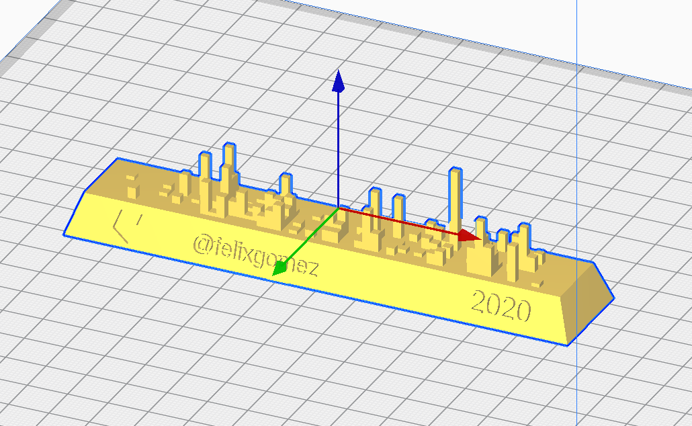
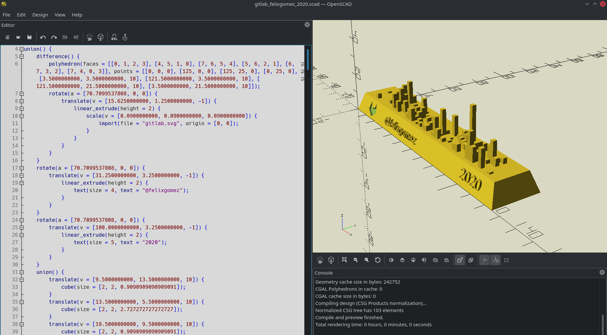

# Your Gitlab's contributions in 3D Skyline

`gitlab-skyline` is a Python command to generate a skyline figure from Gitlab contributions like Github does at https://skyline.github.com/

```
~ gitlab-skyline -h
usage: gitlab-skyline [-h] username [year] [max_requests]

Create STL from Gitlab contributions

positional arguments:
  username      Gitlab username (without @)
  year          Year of contributions to fetch
  max_requests  Max. simultaneous request to Gitlab. Don't mess with their server!

optional arguments:
  -h, --help    show this help message and exit

Enjoy!

```



# Requirements and installation

`gitlab-skyline` requires  python3 and OpenSCAD.


Create your virtual environment as usual and install dependencies with
```
pip install -r requirements.txt
```

Install OpenSCAD from https://www.openscad.org/downloads.html and ensure that openSCAD executable is working with
```
openscad --version
```



# Quickstart
```
python gitlab-skyline felixgomez 2020
```
or
```bution
./gitlab-skyline felixgomez 2020
```

if file has execution permissions.

# Motivation

A few days ago I came across the Github skyline web application and it seemed like a good idea to be able to export the activity in skyline format to STL.

It quickly became viral among my friends, but in my daily work I use Gitlab more. That's when I came up with the idea to replicate it for Gitlab: I **needed** to have my own contribution skyline!

# Some details 

The project was developed on a Friday afternoon, although I had consulted some information previously, so do not expect quality code and wonders. As always **pull requests are welcome!** 😍

At first I was thinking to use the well known Gitlab endpoint `https://gitlab.com/users/userna,e/calendar.json` but the information it provides is for one year back from now.

As far as I know Gitlab does not provide an endpoint to obtain contribution information by year but digging a bit I found that a call to `https://gitlab.com/users/username/calendar_activities?date=2021-02-01` returns an HTML response easy to scrape.

I use classic [`BeautifulSoup`](https://www.crummy.com/software/BeautifulSoup/) for scraping and [`aiohttp`](https://docs.aiohttp.org/en/stable/) and [`asyncio`](https://docs.python.org/3/library/asyncio.html) to go asynchronous and speed up the scraping process.

There is an extra option to the `gitlab-skyline` command to control concurrent requests to Github to avoid the "Too many request" message from their server.

[SolidPython](https://github.com/SolidCode/SolidPython) giis a beautiful pcode to piece of code to work with OpenSCAD from Python.

[`Numpy`](https://numpy.org/) wasn't really necessary, but it makes calculating and ordering matrices much easier.

[`Inkscape`](https://inkscape.org/) was used to vectorize the Gitlab logo for extrusion (pending to correct the Viewbox due to lack of time).

# Mesh optimization

I love openSCAD for a long time but there are some old well known issues related with errors in the generated geomerty. If you detect some on the final STL you could use https://www.meshlab.net/ to correct them.

# Thanks!
