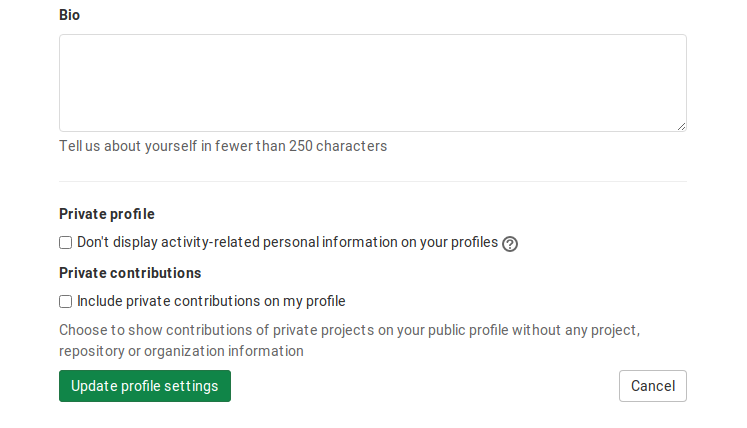
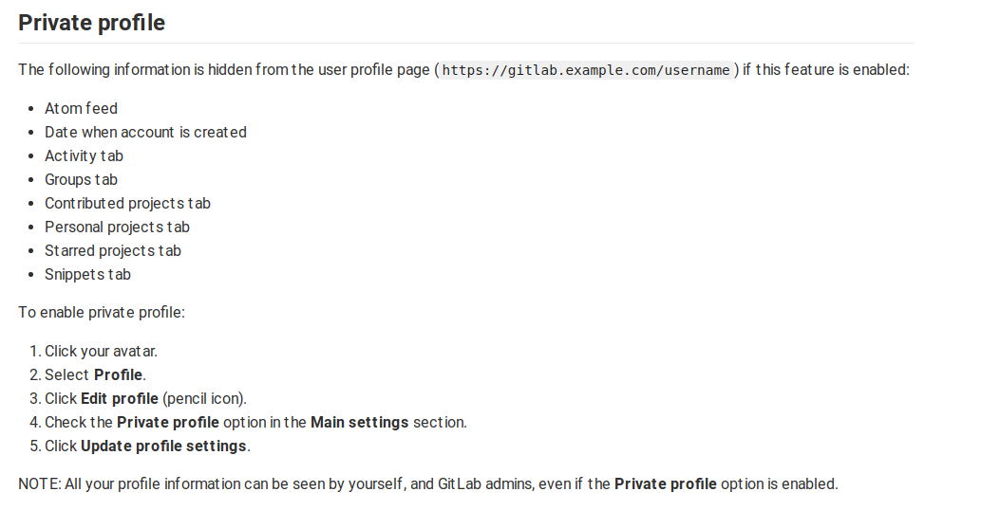

# Your Gitlab's contributions in a 3D Skyline

`gitlab-skyline` is a Python command to generate a skyline figure from Gitlab contributions as Github did at https://skyline.github.com/

```
~ usage: gitlab-skyline [-h] [--domain [DOMAIN]] [--max_requests [MAX_REQUESTS]] username [year]

Create STL from Gitlab contributions

positional arguments:
  username              Gitlab username (without @)
  year                  Year of contributions to fetch

optional arguments:
  -h, --help            show this help message and exit
  --domain [DOMAIN]     GitlabEE/CE custom domain
  --max_requests [MAX_REQUESTS]
                        Max. simultaneous requests to Gitlab. Don't mess with their server!

Enjoy!

```
View a sample result of the preview at [samples/gitlab_felixgomez_2020.stl](samples/gitlab_felixgomez_2020.stl) and OpenSCAD generated code at [samples/gitlab_felixgomez_2020.scad](samples/gitlab_felixgomez_2020.scad).


# Requirements and installation

`gitlab-skyline` requires python3 and OpenSCAD. (need Python version >= 3.7)


Create your virtual environment as usual and install dependencies with
```
pip install -r requirements.txt
```

Install OpenSCAD from https://www.openscad.org/downloads.html and ensure that openSCAD executable is working with
```
openscad --version
```


# Quickstart
```
python gitlab-skyline felixgomez 2020
```
or
```
./gitlab-skyline felixgomez 2020
```

if file has execution permissions.

If you want to get contributions from a custom installation you can use

```
./gitlab-skyline felixgomez 2020 --domain="https://customdomain.dev:8080"
```

# Docker Usage

For convience, a docker image is produced to generate the stl image file for you:

`docker run -v $PWD:/data registry.gitlab.com/felixgomez/gitlab-skyline <username> [<year>]`

Example: `docker run -v $PWD:/data registry.gitlab.com/felixgomez/gitlab-skyline felixgomez`

To use any custom parameters, simply append to the docker run command.

# Using it in private/custom Gitlab installations

As said before, you can use it in custom installations through the `--domain` modifier.

**Don't forget to make your contributions public in your user profile settings.**




# Motivation

A few days ago I came across the Github skyline web application and it seemed like a good idea to be able to export the activity in skyline format to STL.

It quickly became viral among my friends, but in my daily work I use Gitlab more. That's when I came up with the idea to replicate it for Gitlab: I **needed** to have my own contribution skyline!

# Some details 

> The project was developed on a Friday afternoon, although I had consulted some information previously, so do not expect quality code and wonders. As always **pull requests are welcome!** 😍

At first I was thinking to use the well known Gitlab endpoint `https://gitlab.com/users/username/calendar.json` but the information it provides is for one year back from now.

As far as I know Gitlab does not provide an endpoint to obtain contribution information by year but digging a bit I found that a call to `https://gitlab.com/users/username/calendar_activities?date=2021-02-01` returns an HTML response easy to scrape.

I made use of classic [`BeautifulSoup`](https://www.crummy.com/software/BeautifulSoup/) for scraping, [`aiohttp`](https://docs.aiohttp.org/en/stable/) and [`asyncio`](https://docs.python.org/3/library/asyncio.html) to go asynchronous and speed up the scraping process.

There is an extra option (`--max-requests`) to the `gitlab-skyline` command to control concurrent requests to Github to avoid the *"Too many requests"* message from their server.

[`SolidPython`](https://github.com/SolidCode/SolidPython) is a beautiful piece of code allowing to generate OpenSCAD code from Python.

[`Inkscape`](https://inkscape.org/) was used to vectorize the Gitlab logo for extrusion (pending to correct the Viewbox due to lack of time).

# Mesh optimization

I love openSCAD for a long time but there are some old well known issues related with errors in the generated geometry. If you detect some on the final STL you could use https://www.meshlab.net/ to correct them.

# Thanks!

I hope you like it!
